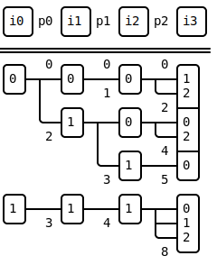

<table>
    <tr><td> Author </td><td> Erik Welch (eriknw) </td></tr>
    <tr><td> Status </td><td> Draft </td></tr>
    <tr><td> Created </td><td> Aug 26, 2022</td></tr>
    <tr><td> Resolution </td><td> &lt;url&gt; (Accepted | Rejected | Withdrawn)</td></tr>
</table>

## Abstract

This design document considers what is necessary to support sparse rank N arrays.  We will consider a narrow scope and broad scope:
1. how to support rank 1 and 2 arrays in a way that will let us support rank N arrays in the future, and
2. how to fully support rank N arrays

We use [TACO](http://tensor-compiler.org/) and [MLIR's sparse_tensor dialect](https://mlir.llvm.org/docs/Dialects/SparseTensorOps/) as motivation for sparse rank N arrays (or tensors), and our proposal will be fully compatible with them.

## Motivation

We are developing a specification for binary storage of sparse matrices and vectors.  The solution will entail saving metadata and storing multiple one-dimensional arrays.  Storing rank N arrays need the same things: metadata and one-dimensional arrays.  So, why not try to support arrays of arbitrary dimension if it's easy to do so?  This will make the binary storage format more capable.

Many people are already familiar with existing compression schemes for arrays, including COO, CSR (or CRS), DCSC (or HyperCSC), CSF, and more.  I think it would be best to reuse these names when possible to increase usability.  Doing so will make our documentation clearer, and we want users who only use 1d and 2d arrays to be comfortable.  Is this possible with a generic scheme that supports rank N arrays?  Let's find out!

## Detailed description

### Rank 1 and 2 arrays

Since we don't yet have specific proposals for how to support rank 1 and 2 arrays, this section will be speculative and constructive.

#### Names of constituent  arrays

Using names like `rows` and `col_indices` does not scale to arbitrary rank.  For example, the two arrays for CSR may typically be called `indptr` and `col_indices`, but we can use names such as `pointers_0` and `indices_1` that can be generalized to arbitrary rank.

Here's how these arrays would be used for common structures:

| Type | `indices_0` | `pointers_0` | `indices_1` | `axis_order` |
| -- | :--: | :--: | :--: | :--: |
| **Vector** | Yes | | | `[0]` |
| **CSR** | | Yes | Yes | `[0, 1]` |
| **CSC** | | Yes | Yes | `[1, 0]` |
| **DCSR** | Yes | Yes | Yes | `[0, 1]` |
| **DCSC** | Yes | Yes | Yes | `[1, 0]` |
| **COO** | Yes | | Yes | `[0, 1]` or `[1, 0]` |

`pointers_i` array is used to group indices of the current dimension to the indices of the next dimension.

<!-- TODO: Below is an example of DCSR compression.  The indices are in boxes, and pointers are next to the lines: -->

#### Row or column orientation

Observe that CSR and CSC both use `pointers_0` and `indices_1` in the table above, and `axis_order` is used to determine whether the array is row-major or column-major.  This is also called `dimOrdering` in [MLIR sparse_tensor](https://mlir.llvm.org/docs/Dialects/SparseTensorOps/#parameters).  It is necessary for `axis_order` to be a list or tuple to support different axis ordering in higher dimensions such as `axis_order=[1, 3, 0, 2]`.

For COO, `axis_order` indicates whether `indices_0` is rows (`axis_order=[0, 1]`) or columns (`axis_order[1, 0]`).

_Proposal:_ if the compression type (such as CSR) ends in **"R"**, then `axis_order` uses **r**egular ordering `0, 1, ..., N-1`, and if it ends in **"C"**, then `axis_order` uses **c**ontrary ordering `N-1, N-2, ... 1, 0`.

<!-- Perhaps `axis_order` could optionally be `"R"` or `"C"`. -->

#### Simplifying assumptions

Traditionally, COO is a common and flexible format.  It can often have duplicate indices, and indices may not be sorted.  Other storage formats can also allow for duplicate indices or unsorted indices; for example SuiteSparse:GraphBLAS import and export of CSR allows the column indices to be unsorted.

Let us assume that the _standard_ storage formats that we are designing will have unique indices, and the indices will be sorted lexicographically by `indices_0`, `indices_1`, etc.

_Remark:_ it would be nice to easily allow extensions to our specification so that e.g. SuiteSparse:GraphBLAS could keep data unsorted.  Data readers should fail when reading unknown extensions that break the standard storage format.

#### Names of compression types

Indices for a dimension may be compressed in three different ways: like COO, CSR, or DCSR.  Let's give these names:

| Name | Abbv | `indices_i` | `pointers_i` | Like |
| -- | :--: | :--: | :--: | :--: |
| **sparse** | **`S`** | Yes | | COO |
| **compressed** | **`C`** | | Yes | CSR |
| **doubly compressed** | **`DC`** | Yes | Yes | DCSR |

- **"sparse" (`S`)** dimension indices are aligned to the indices of the following dimension (or values if the final dimension)
  - `len(indices_i) == len(indices_{i+1})`, or `len(indices_i) == len(values)` if the final dimension
- **"compressed" (`C`)** dimension allows fast O(1) lookup by the index into the pointers array
  - The previous dimension does not need to store `pointers_{i-1}`
- **"doubly compressed" (`DC`)** stores unique index values (so O(1) lookup isn't possible) and pointers to the next dimension
  - `len(pointers_i) == len(indices_i) + 1`

The final dimension must be "sparse" (`S`).  The compression schemes for rank 2 arrays are:

| Dim 0 | Dim 1 | Ordering | Abbv |
| :--: | :--: | :--: | :--: |
| C compressed | S sparse | R `[0, 1]` | CSR |
| C compressed | S sparse | C `[1, 0]` | CSC |
| DC doubly compressed | S sparse | R `[0, 1]` | DCSR |
| DC doubly compressed | S sparse | C `[1, 0]` | DCSC |
| S sparse | S sparse | R `[0, 1]` | SSR |
| S sparse | S sparse | C `[1, 0]` | SSC |

CSR, CSC, DCSR, and DCSC are familiar and keep their original meanings.

#### COO

SSR and SSC in the previous table are new and are instances of COO with sorted indices and no duplicates (according to our simplifying assumptions).  SSR indices are lexicographically sorted by row then column, and a backronym could be "sorted sparse rows" (or "simple" or "standard" instead of "sorted").  Conversely, SSC indices are lexicographically sorted by column then row, and a backronym could be "sorted sparse columns".

We can consider also keeping COO as a type of compression.  COO does not need to be sorted, and metadata can indicate whether or not it may have duplicate indices.

#### Dense dimensions or multidimensional values array

Examples of structures with dense dimensions are dense vectors, dense matrices, and sparse vectors where each value is a dense array (so it's actually a matrix).  It is an open question if and how we want to handle these.  It may be straightforward to support this by allowing the values array to be N-dimensional and have metadata that indicates the shape and layout.

Per our language, we do not consider CSR to have any dense dimensions.  Dense dimensions are those that can be combined into a dense, multidimensional values array.

#### Multiple value arrays

It may be reasonable for the same sparse structure to have multiple value arrays.  This is another open design question.

Supporting rank N arrays probably doesn't constrain how we may support having multiple value arrays.  A potential complication is when one values array is a scalar per element, and another is an array per element.

#### Attributes

It may be useful to store attributes such as `is_symmetric`, `is_structure_symmetric`, `is_upper_triangular`, `ndiag`, etc.  It may be more complicated to have attributes like this in a way that generalizes to higher dimensions.

### Rank N arrays

#### Names of constituent arrays

Use `indices_0`, `pointers_0`, `indices_1`, `pointers_1`, ..., `indices_{N-1}`.

#### Dimension order

Use `axis_order` with the same semantics as `dimOrdering` in MLIR sparse tensor dialect.

<!-- TODO: briefly explain semantics of `axis_order`. -->

We can reuse "R" to mean regular ordering `axis_order=[0, 1, ..., N-1]` and "C" to mean contrary ordering `axis_order=[N-1, N-2, ..., 1, 0]`.  Perhaps we can use "X" to indicate any other ordering.

#### Compression types

The last dimension must be "sparse" (`S`).  All other dimensions may be sparse (`S`), compressed (`C`), or doubly compressed (`DC`).  This fully supports the TACO and MLIR sparse tensor formats.

For larger dimensions, it is sometimes more clear to separate the abbreviated structure with hyphens.  For example, `C-DC-S-S-R` instead of `CDCSSR`.

**Examples:**

**`DC-DC-DC-S`**

**`S-C-DC-S`**

See more examples of different compression types on a rank 4 array here:

https://nbviewer.org/github/GraphBLAS/binsparse-specification/blob/main/spz_python/notebooks/Example_Rank4.ipynb

#### COO

As with rank 2, we can support sorted COO without duplicates as e.g. SSSSSSR.

We can consider supporting rank N COO that is unsorted and may have duplicates.

#### Dense dimensions or multidimensional values array

Probably no change necessary to support rank N.

This is important to support in order to fully match TACO and MLIR sparse tensor.

This is also necessary to support semi-COO (sCOO):
- ["Optimizing Sparse Tensor Times Matrix on
Multi-core and Many-core Architectures" by Jiajia Li, et al
](http://fruitfly1026.github.io/static/files/sc16-ia3.pdf)

#### Multiple value arrays

Probably no change necessary to support rank N.

#### Different jargon

Sparse compression of rank N arrays is an active area of research, and users of that community may prefer the use of different jargon.  For example, _modes_ (the order of dimensions), _fibers_, and _slices_.  Also, _tensor_ is generally understood to be a multidimensional array, but may have different meanings for physicists, mathematicians, Python users (e.g., a tensor is an N-D array that can use GPUs), etc.

#### Chunking strategies

Not determined for ranks 1 and 2 yet, but probably little to no change necessary to support rank N.

We may want to consider whether our strategy can support HiCOO:
- https://sc17.supercomputing.org/SC17%20Archive/tech_poster/poster_files/post213s2-file3.pdf
- http://fruitfly1026.github.io/static/files/sc18-li.pdf

### Differences from TACO and MLIR sparse tensor

Our proposal uses different naming schemes than TACO and MLIR sparse tensor, which use:

| Type | Dim 0 | Dim 1 |
| -- | :--: | :--: |
| CSR | dense | compressed |
| DCSR | compressed | compressed |
| DCSR (alt) | singleton | compressed |
| COO | singleton | singleton |

- "dense" dimensions store no arrays
- "compressed" dimension store `pointers_i` and `indices_i` arrays
- "singleton" dimension store `indices_i` arrays

Note that TACO does not support "singleton" compression, and "singleton" may not be fully supported yet in MLIR sparse tensor.

The main difference from our proposal is the use of `pointer_i`.  In TACO and MLIR sparse tensor, `pointers_i` groups the _previous_ indices to the current indices.  In our proposal, `pointers_i` groups the current indices to the _next_ indices.

In TACO, DCSR is constructed using "compressed", "compressed" dimensions.  This results in _two_ `pointers` arrays, which is not standard DCSR.  Only one `pointers` array is necessary.  In MLIR, there are two ways to specify DCSR arrays.  Our proposal only has one way to specify DCSR, and it does not have an extra, unnecessary `pointers` array.

It is straightforward to convert from our specification to MLIR sparse tensor specification with only "compressed" and "dense" dimensions:
1. Increment `pointers` arrays, so e.g. `pointers_0` becomes `mlir_pointers_1`
2. If a dimension has both `mlir_pointers_i` and `indices_i`, then it is MLIR's "compressed"
3. If a dimension has only `indices_i`, then it is MLIR's "singleton"
4. If a dimension does not have `mlir_pointers_i` or `indices_i`, then it is MLIR's "dense"

Converting to TACO-style with "singleton" and "compressed-nonunique" is signficantly more difficult.

### Extensions

#### Multigraph support

It would be easy support multigraphs, which can have multiple edges between nodes.  This is done by allowing duplicate indices so an index can have multiple values.  COO naturally supports this.  Other formats can as well.

Our proposal needs two changes to support multigraphs:
1. Allow the final dimension to be "compressed" (`C`) or "doubly compressed" (`DC`) where the pointers group indices to values
2. Add a flag to the global metadata to indicate whether there may be duplicate indices

Observe that this is a natural, "obvious" consequence of our proposal, whereas TACO and MLIR sparse tensor cannot support multigraphs like this without adding another dimension.

This gives us two more compression types for vectors ("compressed" and "doubly compressed"), and 12 more compression types for matrices (`SCR`, `SDCR`, `CCR`, `CDCR`, `DCCR`, `DCDCR` and the columnwise variants).  These should only be used for multigraphs.

#### Unsorted dimensions

Indices in "sparse" and "doubly compressed" dimensions do not need to be sorted, but `pointers` boundaries must still be respected.  For example, import and export in SuiteSparse:GraphBLAS supports unsorted column indices within each row for CSR and DCSR.

If there are multiple sequential "sparse" dimensions (such as COO), only the first one needs to indicate that it is unsorted.  This is because sortedness only applies to indices between pointers; for example, column indices for a given row in CSR are between pointers.  Furthermore, if a "sparse" dimension _did_ store pointers, it would be `[0, 1, 2, ..., N]`, which means there is only one index in the next dimension that is grouped between pointers, and sortedness of a single element is extraneous.

This could be supported by adding a flag to each "sparse" and "doubly compressed" dimension.

#### Balanced CSF

This is an extension to "doubly compressed" dimensions based on B-CSF in ["Load-Balanced Sparse MTTKRP on GPUs" by Israt Nisa, et al](https://arxiv.org/pdf/1904.03329.pdf).  It allows indices in "doubly compressed" dimensions to be duplicated in order for subtrees to be more comparably sized.

This could be supported by adding a flag to each "doubly compressed" dimension.

#### Different sub-tree compressions

Sometimes compression can be improved by using different compression schemes for different groups of indices.  Examples:

- HB-CSF: https://arxiv.org/pdf/1904.03329.pdf
- MM-CSF: https://par.nsf.gov/servlets/purl/10172913

This may be challenging or complicated to support.

