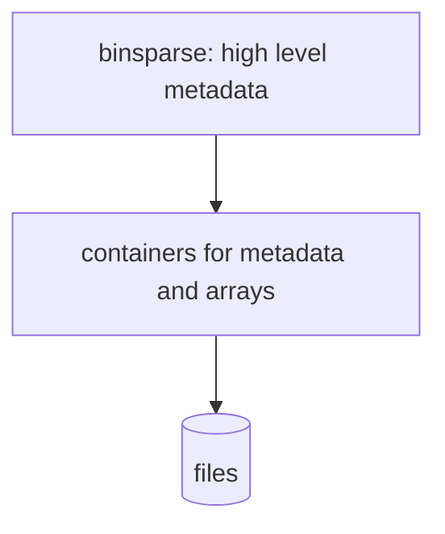
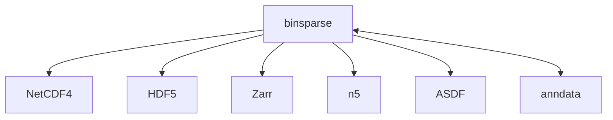

- **Author:** [Erik Welch](https://github.com/eriknw)
- **Date:** 2022-09-07
- **Purpose:** Strawman proposal to help discuss [PR #3](https://github.com/GraphBLAS/binsparse-specification/pull/3)
and its [proposal](https://github.com/GraphBLAS/binsparse-specification/blob/main/design_docs/01_rankN_arrays.md)
- https://github.com/GraphBLAS/binsparse-specification

# High level perspective

Let's call our binary sparse storage format `binsparse` in this document.

For high level design, let's assume we will use existing data storage formats that can store **metadata** and **arrays** including the shape and data type of arrays:

Example data storage formats:

These containers are higher level than e.g. ZIP, LMDB, and Tar files, and handle data types, multidimensional arrays, endianness, compression, etc.

Our current design goal, then, is to determine the high level metadata and arrays for sparse arrays.

We should also consider using `binsparse` as an _embedded_ spec to be used as components in other storage formats.


# Version 1.0
- Very limited scope
  - Simple and opinionated with no options
  - Easy to explain and understand
  - Smooth transition to version 2.0
  - Cover most of MatrixMarket format
- Sparse formats: COO, CSR, CSC, DCSR, DCSC, sparse vector (VEC)
- Indices must be lexicographically sorted by dim0, dim1
- No duplicate indices allowed
  - Applies to COO
  - Applies to row indices in DCSR
- May support dense and bitmap formats
- May allow attributes such as `is_symmetric`, `ndiag`, etc.

Assume all metadata contains format type and version, such as:
```json
{
  "spec_version": "https://purl.org/binsparse/spec/core/1.0"
}
```

<table style="text-align:left; border:1px solid #ccc;">
    <tr></tr>
    <tr><th> CSR </th><th> CSC </th><th> DCSR </th><th> DCSC </th><th> COO </th><th> VEC </th></tr>
<tr><td>

```json
{
  "format": "CSR",
  "shape": [m, n]
}
```

</td>
<td>

```json
{
  "format": "CSC",
  "shape": [m, n]
}
```

</td>
<td>

```json
{
  "format": "DCSR",
  "shape": [m, n]
}
```

</td>
<td>

```json
{
  "format": "DCSC",
  "shape": [m, n]
}
```

</td>
<td>

```json
{
  "format": "COO",
  "shape": [m, n]
}
```

</td>
<td>

```json
{
  "format": "COO",
  "shape": [n]
}
```

</td>
</tr>
    <tr></tr>
<tr>
<td>

```
Data:
 - pointers_0
 - indices_1
 - values

```

</td>
<td>

```
Data:
 - pointers_0
 - indices_1
 - values

```

</td>
<td>

```
Data:
 - indices_0
 - pointers_0
 - indices_1
 - values
```

</td>
<td>

```
Data:
 - indices_0
 - pointers_0
 - indices_1
 - values
```

</td>
<td>

```
Data:
 - indices_0
 - indices_1
 - values

```

</td>
<td>

```
Data:
 - indices_0
 - values


```

</td>
</tr>
</table>

### Questions
Inluding some reactions from the September 7 meeting:

- Should we save datatypes or defer to the storage container?
  - e.g., `{"data_types": {"indices_0": "uint64", "values": "float64"}`
    - *Jim says yes*
    - *Keep v1 simple*
    - *Researching data types is an action item*
  - If so, should we indicate endianness such as `"<i4"`?
    - *Jim and Ben say no*
- Should we add `"COOR"` and `"COOC"` (or `"COO-R"` and `"COO-C"`) formats that are sorted by row then column and column then row?
  - *Jim, yes for COOR, COOC*
- Should `"COO"` format be "special" and allowed to be unsorted and/or have duplicates?
  - *Ben: COO defaults to COOR*
- Should we always include `dim_types` (see below)?
  - *Nah*
- Should we add a field for arbitrary user metadata such as comments?
  - *Yes, a field such as `"attrs"` that can save key-value pairs*
  - *Would be nice to store SuiteSparse collection w/o losing any info*
  - *Erik: follow Zarr's example and don't allow arbitrary key-value pairs--have a specified place for user metadata*
- Should bitmap and full formats be in v1?
  - *Jim, Ben, Erik: gut reactions--no*
  - *Isaac would like to consider memory-friendliness*

```
Easy datatypes
    int8 int16 int32 int64
    uint8 uint16 uint32 uint64
    float32 float64

Harder datatypes
    bool
    complex64
    int128
    uint128
    float16
    fixed-width UDTs (void or composed?)
    strings or variable-length
    datetimes
```

#### Ideas for handling data types and values
Single values array:
```json
{
  "format": "CSR",
  "shape": [m, n],
  "data_types": {"pointers_0": "int32", "indices_1": "uint64", "values": "float64"},
}
```
Iso-value:
```json
{
  "format": "CSR",
  "shape": [m, n],
  "data_types": {"pointers_0": "int32", "indices_1": "uint64", "values": "float64"},
  "isovalue": 1.0

  "data_types": {"pointers_0": "int32", "indices_1": "uint64", "values": {"iso[float64"]: 1.0}},
}
```
No value, structure-only:
```json
{
  "format": "CSR",
  "shape": [m, n],
  "data_types": {"pointers_0": "int32", "indices_1": "uint64", "values": null}

  "is_structure_only": true
}
```

# Version 2.0
- Version 2.x is an extension of and can read version 1.x
- Support multidimensional sparse arrays
- Support duplicated indices
  - common for COO
- Support unordered indices
  - common for COO
  - "jumbled" columns in SuiteSparse:GraphBLAS CSR and DCSR
- Support multiple value arrays, no value arrays, and iso-valued arrays
- Support per-dimension, per-values, and global attributes
- Allow extensions

<table style="text-align:left; border:1px solid #ccc;">
    <tr></tr>
    <tr><th> CSR </th><th> CSC </th></tr>
<tr>
<td>

```json
{
  "format": "CSR",
  "shape": [m, n],

  "dim_types": ["compressed", "sparse"],
  "dim_order": [0, 1],

  "dim_properties": {"1": {"is_ordered": true}},
  "properties": {"has_duplicates": false},

  "dim_sizes": [m, n],
  "dim_taco": ["dense", "compressed"]
}
```

</td>
<td>

```json
{
  "format": "CSC",
  "shape": [m, n],

  "dim_types": ["compressed", "sparse"],
  "dim_order": [1, 0],

  "dim_properties": {"1": {"is_ordered": true}},
  "properties": {"has_duplicates": false},

  "dim_sizes": [n, m],
  "dim_taco": ["dense", "compressed"]
}
```

</td>
</tr>
    <tr><th> DCSR </th><th> DCSC </th></tr>
<tr>
<td>

```json
{
  "format": "DCSR",
  "shape": [m, n],

  "dim_types": ["doubly_compressed", "sparse"],
  "dim_order": [0, 1],

  "dim_properties": {
    "0": {"is_ordered": true, "is_unique": true},
    "1": {"is_ordered": true}
  },
  "properties": {"has_duplicates": false},

  "dim_sizes": [m, n],
  "dim_taco": ["compressed", "compressed"]
}
```

</td>
<td>

```json
{
  "format": "DCSC",
  "shape": [m, n],

  "dim_types": ["doubly_compressed", "sparse"],
  "dim_order": [1, 0],

  "dim_properties": {
    "0": {"is_ordered": true, "is_unique": true},
    "1": {"is_ordered": true}
  },
  "properties": {"has_duplicates": false},

  "dim_sizes": [n, m],
  "dim_taco": ["compressed", "compressed"]
}
```

</td>
</tr>
    <tr><th> COO </th><th> Vector </th></tr>
<tr>
<td>

```json
{
  "format": "COO",
  "shape": [m, n],

  "dim_types": ["sparse", "sparse"],
  "dim_order": [0, 1],

  "dim_properties": {
    "0": {"is_ordered": true},
    "1": {"is_ordered": true}
  },
  "properties": {"has_duplicates": false},

  "dim_sizes": [m, n],
  "dim_taco": ["compressed-nonunique", "singleton"]
}
```

</td>
<td>

```json
{
  "format": "COO",
  "shape": [n],

  "dim_types": ["sparse"],
  "dim_order": [0],

  "dim_properties": {
    "0": {"is_ordered": true}
  },
  "properties": {"has_duplicates": false},

  "dim_sizes": [n],
  "dim_taco": ["compressed"]
}

```

</td>
</tr>
</table>

### `dim_types`
  - Each dimension is one of `"sparse"`, `"compressed"`, or `"doubly_compressed"` as described here:
    - https://github.com/GraphBLAS/binsparse-specification/blob/main/design_docs/01_rankN_arrays.md
  - Design choices
    - required, even in version 1.0
    - required _except_ for formats in version 1.0
    - not required if it can be inferred from the format name
      - Example: `"format": "SCSR"` --> `"dim_types": ["sparse", "compressed", "sparse"]`
    - make `format` optional if `dim_types` is given?

### `dim_order`
  - Logically reorders dimensions
      - Like `dimOrdering` in [MLIR sparse tensor](https://mlir.llvm.org/docs/Dialects/SparseTensorOps/)
      - `shape = [dim_sizes[i] for i in dim_order]`
      - `dim_sizes = [shape[i] for i in argsort(dim_order)]`
  - Optional; defaults to `[0, 1, ..., N-1]`
  - _(choice)_ May infer from last character in `format` if `dim_types` can also be inferred:
    - `"R"` results in `[0, 1, ..., N-1]`
    - `"C"` results in `[N-1, ..., 1, 0]`
    - otherwise `dim_order` is required (or choose a character like `"X"` to mean this)
  - _(choice)_ Make required like `dim_types`?

### `dim_properties`
  - Optional; dictionary of properties for specified dimensions
  - Default properties:
    - `"compressed"`: `{}`
    - `"sparse"`: `{"is_ordered": true}`
    - `"doubly_compressed"`: `{"is_ordered": true, "is_unique": true}`
  - `is_ordered` property
    - Are the indices in `indices_i` in order for `"sparse"` or `"doubly_compressed"` dimensions?
    - Indicates whether `indices_0` is sorted
    - Indicates whether `indices_i` with the same previous indices (i.e., between `pointers_{i-1}` boundaries) is sorted
    - TACO (paper) _may_ call this `ordered`
    - SuiteSparse:GraphBLAS uses `jumbled`
  - `is_unique` property
    - Indicates whether `indices_i` has no duplicates for `"doubly_compressed"` dimensions
    - TACO (paper) _may_ call this `unique`
    - If `false`, then this conceptually splits a single index tree into multiple trees

### `properties`
  - Overall properties of the entire sparse index structure
  - Optional; defaults to `{"has_duplicates": false}`
  - `has_duplicates` property
    - Indicates whether the sparse array has values with the same indices
  - May add `is_symmetric`, `ndiag`, `fill_value`, etc

### `dim_sizes`
  - Optional; allowed for clarity
  - Determined from `dim_order` and `shape`
      - `shape = [dim_sizes[i] for i in dim_order]`
      - `dim_sizes = [shape[i] for i in argsort(dim_order)]`

### `dim_taco`
  - Dimension names for TACO and MLIR sparse
  - Optional; allowed for clarity
  - Determined by `dim_types` (when possible)
  - Each dimension is one of `"compressed"`, `"dense"`, `"singleton"`, or `"compressed-nonunique"`

## Value arrays

Still being explored; don't yet have a complete strawman proposal.

Some ideas:
<table style="text-align:left; border:1px solid #ccc;">
    <tr></tr>
    <tr><th> Full v1 </th><th> Bitmap v1</th></tr>
<tr>
<td>

```json
{
  "format": "Full",
  "shape": [m, n],
}
```

</td>
<td>

```json
{
  "format": "Bitmap",
  "shape": [m, n],
}
```

</td>
</tr>
    <tr></tr>
<tr>
<td>

```
Data:
 - values

```

</td>
<td>

```
Data:
 - values
 - bitmap
```

</td>
</tr>
    <tr><th> Full v2 </th><th> Bitmap v2</th></tr>
<tr>
<td>

```json
{
  "format": "Full",
  "shape": [m, n],

  "dim_types": ["full", "full"],
  "dim_order": [0, 1],

  "dim_properties": {},
  "properties": {"has_duplicates": false},

  "dim_sizes": [m, n],
  "dim_taco": ["dense", "dense"]
}


```

</td>
<td>

```json
{
  "format": "Bitmap",
  "shape": [m, n],

  "dim_types": ["full", "full"],
  "dim_order": [0, 1],

  "dim_properties": {},
  "properties": {"has_duplicates": false},

  "dim_sizes": [m, n],
  "dim_taco": ["dense", "dense"],

  "value_bitmaps": {"values": "bitmap"}
}
```

</td>
</tr>
    <tr></tr>
<tr>
<td>

```
Data:
 - values

```

</td>
<td>

```
Data:
 - values
 - bitmap
```

</td>
</tr>
    <tr><th> CSR (bitmap) </th><th> DCSC (iso) </th></tr>
<tr>
<td>

```json
{
  "format": "CSR",
  "shape": [m, n],

  "dim_types": ["compressed", "sparse"],
  "dim_order": [0, 1],

  "dim_properties": {"1": {"is_ordered": true}},
  "properties": {"has_duplicates": false},

  "dim_sizes": [m, n],
  "dim_taco": ["dense", "compressed"],

  "value_bitmaps": {"values": "bitmap"}
}


```

</td>
<td>

```json
{
  "format": "DCSC",
  "shape": [m, n],

  "dim_types": ["doubly_compressed", "sparse"],
  "dim_order": [1, 0],

  "dim_properties": {
    "0": {"is_ordered": true, "is_unique": true},
    "1": {"is_ordered": true}
  },
  "properties": {"has_duplicates": false},

  "dim_sizes": [n, m],
  "dim_taco": ["compressed", "compressed"],

  "value_isovalues": {"values": 0}  // needs data_type!
}
```

</td>
</tr>
    <tr></tr>
<tr>
<td>

```
Data:
 - pointers_0
 - indices_1
 - values
 - bitmap
```

</td>
<td>

```
Data:
 - indices_0
 - pointers_0
 - indices_1

```

</td>
</tr>
    <tr><th> CSC (many value arrays) </th><th> DCSC (structure-only) </th></tr>
<tr>
<td>

```json
{
  "format": "CSC",
  "shape": [m, n],

  "dim_types": ["compressed", "sparse"],
  "dim_order": [1, 0],

  "dim_properties": {"1": {"is_ordered": true}},
  "properties": {"has_duplicates": false},

  "dim_sizes": [n, m],
  "dim_taco": ["dense", "compressed"],

  "value_names": ["foo", "bar"],
}


```

</td>
<td>

```json
{
  "format": "DCSR",
  "shape": [m, n],

  "dim_types": ["doubly_compressed", "sparse"],
  "dim_order": [0, 1],

  "dim_properties": {
    "0": {"is_ordered": true, "is_unique": true},
    "1": {"is_ordered": true}
  },
  "properties": {"has_duplicates": false},

  "dim_sizes": [m, n],
  "dim_taco": ["compressed", "compressed"],

  "value_names": [],
}
```

</td>
</tr>
    <tr></tr>
<tr>
<td>

```
Data:
 - pointers_0
 - indices_1
 - foo
 - bar
```
</td>
<td>

```
Data:
 - indices_0
 - pointers_0
 - indices_1

```

</td>
</tr>
    <tr><th> semi-COO </th><th> CSR (array values) </th></tr>
<tr>
<td>

```json
{
  "format": "SFR",
  "shape": [m, n],

  "dim_types": ["sparse", "full"],
  "dim_order": [0, 1],

  "dim_properties": {"0": {"is_ordered": true}},
  "properties": {"has_duplicates": false},

  "dim_sizes": [m, n],
  "dim_taco": ["compressed-nonunique", "dense"]
}


```

</td>
<td>

```json
{
  "format": "CSFR",
  "shape": [m, n, o],

  "dim_types": ["compressed", "sparse", "full"],
  "dim_order": [0, 1, 2],

  "dim_properties": {
    "0": {"is_ordered": true},
    "1": {"is_ordered": true}
  },
  "properties": {"has_duplicates": false},

  "dim_sizes": [m, n, o],
  "dim_taco": ["dense", "compressed", "dense"],
}
```

</td>
</tr>
    <tr></tr>
<tr>
<td>

```C
Data:
 - indices_0
 - values  // shape = [len(indices_0), n]

```

</td>
<td>

```C
Data:
 - pointers_0
 - indices_1
 - values  // shape = [len(indices_1), o]
```

</td>
</tr>
    <tr><th> CSR (multigraph) </th><th> CSR (variable-size datatype) </th></tr>
<tr>
<td>

```json
{
  "format": "CSR",
  "shape": [m, n],

  "dim_types": ["compressed", "doubly_compressed"],
  "dim_order": [0, 1],

  "dim_properties":
    {"1": {"is_ordered": true, "is_unique": true}
  },
  "properties": {"has_duplicates": true},

  "dim_sizes": [m, n],
  "dim_taco": null,
}

```

</td>
<td>

```json
{
  "format": "CSR",
  "shape": [m, n],

  "dim_types": ["compressed", "sparse"],
  "dim_order": [0, 1],

  "dim_properties": {"1": {"is_ordered": true}},
  "properties": {"has_duplicates": false},

  "dim_sizes": [m, n],
  "dim_taco": ["dense", "compressed"],

  "value_pointers": {"values": "valptr"}
}

```

</td>
</tr>
    <tr></tr>
<tr>
<td>

```
Data:
 - pointers_0
 - indices_1
 - pointers_1
 - values
```

</td>
<td>

```
Data:
 - pointers_0
 - indices_1
 - values
 - valptr
```

</td>
</tr>
</table>
